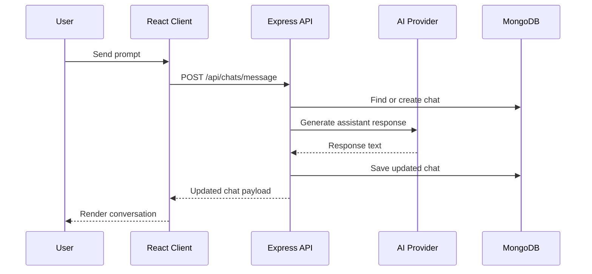

# ChatGPT Clone Design Architecture

## 1. Purpose and Scope

This document describes the design architecture of the ChatGPT Clone project.

It covers:
- Frontend and backend component structure
- Data model and persistence design
- API boundaries and request lifecycle
- AI provider integration strategy
- Non-functional considerations (security, scalability, reliability)
- Deployment and operational view

## 2. System Context

The application is a full-stack chat platform composed of:
- A React client that renders chat UX and manages interaction state
- An Express API server that orchestrates chat operations and AI responses
- MongoDB for persistent chat storage
- External AI providers (OpenAI, Hugging Face, Ollama) plus a demo fallback mode

### High-level responsibilities
- Client: interaction, view state, local UX behavior, user-triggered exports
- Server: persistence, business rules, provider abstraction, API contract
- Database: chat and message persistence with timestamps and branch metadata

## 3. Architecture Style

The project follows a layered, service-backed client-server architecture:
- Presentation layer: React components and context
- Application layer: Express routes and orchestration logic
- Data layer: Mongoose schema/model backed by MongoDB
- Integration layer: AI provider adapters selected by configuration

This is a monorepo-style workspace with separate client and server packages under one root.

## 4. Component View

## 4.1 Frontend (React)

Core frontend modules:
- App shell initializes ThemeProvider and renders Dashboard
- Dashboard coordinates chat state and binds sidebar/chat actions
- Sidebar handles chat list, search, actions menu, theme selection
- Chat panel renders message stream and input composition
- Message component enables copy, edit (user), and fork (assistant)

Key frontend design choices:
- Local state controls active chat, messages, loading state, and sidebar/search UI
- Search is client-side over loaded chat objects
- Exports are generated in browser and downloaded as files
- Theme preference is persisted in browser local storage

## 4.2 Backend (Express + Mongoose)

Core backend modules:
- App factory configures middleware and mounts chat routes
- Route module handles CRUD, messaging, branching, pinning, and title updates
- Model module defines Chat schema with embedded message documents
- Server bootstrap handles MongoDB connection and HTTP startup

Key backend design choices:
- Router factory supports dependency injection for testability
- AI provider is selected at runtime by environment configuration
- Chat title generation is normalized and keyword-based with fallback rules
- Branching preserves lineage using parentChatId and source message index

## 5. Data Model

## 5.1 Chat Entity

Fields:
- title: conversation label for sidebar navigation
- messages: ordered embedded message array
- pinned: boolean for prioritization in sidebar view
- parentChatId: optional parent reference for branched conversations
- branchedFromMessageIndex: source assistant-message index for branch origin
- createdAt, updatedAt: automatic document timestamps

## 5.2 Message Entity (embedded)

Fields:
- role: user or assistant
- content: text body
- createdAt, updatedAt: message-level timestamps

Rationale:
- Embedding messages in chat documents simplifies retrieval of whole threads
- Branch metadata enables lightweight lineage tracking without a separate edge table

## 6. API Surface

Base route prefix: /api/chats

Primary endpoints:
- POST /message: append user message, invoke provider, append assistant response
- POST /: create chat (explicit or inferred title)
- POST /:id/branch: create branched conversation from assistant message
- GET /: list chats sorted by updated timestamp descending
- GET /:id: retrieve single chat
- PUT /:id: update messages array
- PUT /:id/pin: toggle pinned state
- PUT /:id/title: update conversation title
- DELETE /:id: delete conversation

Response behavior:
- Errors return status with JSON error message
- Message endpoint returns chatId, assistant message, and updated chat payload

## 7. Runtime Flow

## 7.1 Send Message Flow

1. Client appends user message optimistically to local UI.
2. If no active chat, client creates a chat with generated title.
3. Client calls POST /api/chats/message with chatId and message.
4. Server loads or creates chat, optionally truncates for edit-regenerate flow.
5. Server appends user message and invokes configured AI provider.
6. Server appends assistant response, saves chat, returns updated payload.
7. Client replaces local message list with canonical server response.

## 7.2 Edit Message Flow

1. User edits an earlier user message in the UI.
2. Client sends replaceFromIndex to message endpoint.
3. Server truncates chat history from that index and regenerates continuation.
4. Updated message stream is returned and rendered.

## 7.3 Branch Conversation Flow

1. User forks from an assistant message.
2. Client calls POST /api/chats/:id/branch with messageIndex.
3. Server validates branch point role and index.
4. Server creates child chat with lineage metadata and branch naming.
5. Client switches context to the newly created branch chat.

## 8. Sequence Diagram

## 9. Configuration and Environment

Important server environment variables:
- MONGO_URI
- AI_PROVIDER (demo, openai, hf, ollama)
- OPENAI_API_KEY, OPENAI_MODEL
- HF_API_KEY, HF_MODEL
- OLLAMA_URL, OLLAMA_MODEL

Operational behavior:
- Missing/invalid provider credentials cause provider call failures
- Demo mode provides deterministic local fallback for development/testing

## 10. Non-functional Design Considerations

## 10.1 Scalability
- Current design is suitable for small-to-medium workloads
- Express and MongoDB can scale horizontally with stateless API instances
- Potential future optimization: pagination or partial loading for large chat histories

## 10.2 Reliability
- Route-level try/catch protects API from uncaught request crashes
- Server exits on initial MongoDB connection failure to avoid half-ready state
- Provider failures return explicit error messages to client

## 10.3 Security
- API keys are expected only on server side via environment variables
- CORS is enabled globally; production tightening by origin allow-list is recommended
- Input validation is minimal; schema and payload validation hardening is recommended

## 10.4 Performance
- Message history is returned as full chat payload on key operations
- Embedded messages optimize thread fetches but may grow document size over time
- Search runs client-side over loaded chats, which may degrade with very large datasets

## 11. Testing Strategy Alignment

Current test layers in repository include:
- Unit tests for frontend utility and component behavior
- Integration tests for frontend chat interactions
- Server integration tests for chat routes
- Acceptance-level frontend tests

Design implication:
- Router factory and modular boundaries support isolated and integration testing patterns

## 12. Deployment View

Local development:
- Root command runs both client and server concurrently
- Client served on port 3000, server API on port 5000

Hosted frontend:
- Static client can be deployed to GitHub Pages
- Backend must be deployed separately and configured for API availability

## 13. Risks and Improvement Opportunities

Known architectural tradeoffs:
- Full-history payload updates may become expensive as threads grow
- No authentication/authorization boundary in current API surface
- Global CORS and broad endpoint availability are development-friendly but permissive

Recommended next improvements:
1. Add request validation middleware for all mutation endpoints.
2. Add auth and per-user chat ownership boundaries.
3. Introduce paginated message retrieval for long conversations.
4. Add structured logging and correlation IDs for diagnostics.
5. Introduce provider timeout/retry policy with circuit-breaker behavior.

## 14. Traceability to Implementation

Primary implementation references:
- client/src/App.js
- client/src/Dashboard/Dashboard.js
- client/src/Dashboard/Sidebar/Sidebar.js
- client/src/Dashboard/Chat/Chat.js
- server/app.js
- server/index.js
- server/routes/chatRoutes.js
- server/models/Chat.js
